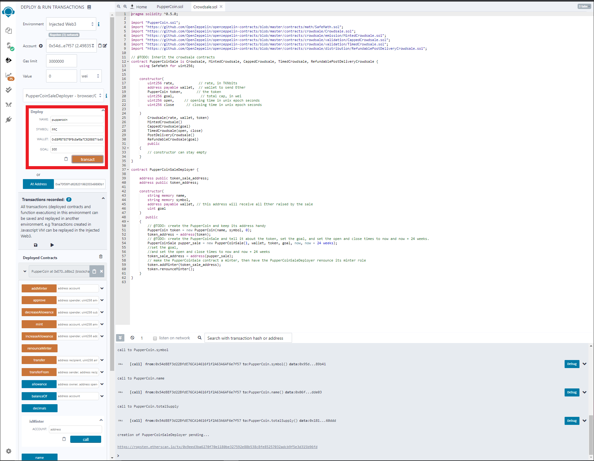

# 21_HW_Advanced_Solidity

Testing on TESTNET Ropsten

1) Deploy PupperCoin.sol using Remix and MetaMask and record the contract address. Use Name: puppercoin; Symbol: PPC; Inital Supply: 0.
    
    Sample as follows (Transaction Fee: 0.00164268596549 Ether; Address: 0xe70f36f1d62620199200349890b1f14895bbbbc2):
    

2) Compile the Crowdsale.sol contract in Remix and paste the contract address from step 1 and click the At Address button. 
    

3) Deploy the PupperCoinSaleDeployer contract (select from the dropdown in MetaMask) and enter the Name, Symbol, Wallet Address and Goal as per the screen shot below.
    

Sample as follows (Transaction Fee: 0.0.00514309720518  Ether; Address: 0x54bfbccdb2041cfb806da1d75fbab24641b4b740): 
    

4) Copy the token address from the PupperCoinSaleDeployer contract. Select the PupperCoinSale contract (select from the dropdown in MetaMask) and enter the token address from the PupperCoinSaleDeployer contract from step 3 in the At Address field and hit the Add Address button. 

Sample as follows (token address 0xFB8660852192821915520897912865F1DB0f6e1a ):
    

5) In the PupperCoinSale contract add in the recipient address in the buyTokens field and hit the buyTokens button. 

Sample as follows (transaction hash 0xa86d36999753d84cf7cf1853cbd8422eec6534bbf9822c85dfd365e0fc77fc3e):
    

